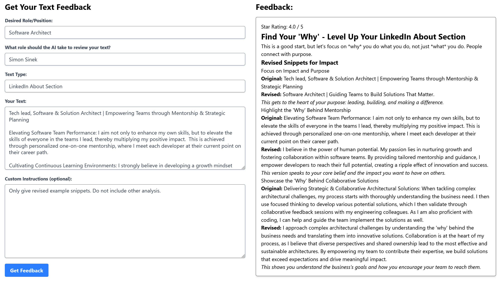

# GenAI Feedback generator

A simple app that asks an LLM to give feedback for a text (such as a cover letter, LinkedIn About page etc), while optionally playing a role
(like an author such as Simon Sinek, or a role, such as 'CTO of a mid-sized SaaS company).



Implemented with Angular and Node.js.

## Setup

create a `backend/.env` file with the following content:
```
GEMINI_API_KEY=<gemini-api-key>
```
[Get your api key here](https://aistudio.google.com/)

Then do:
```
cd backend
npm install
npm run dev
cd ../frontend
npm install
npm run dev
```
(at this time there is only a seup to run this for development)

A browser should open and there you go.